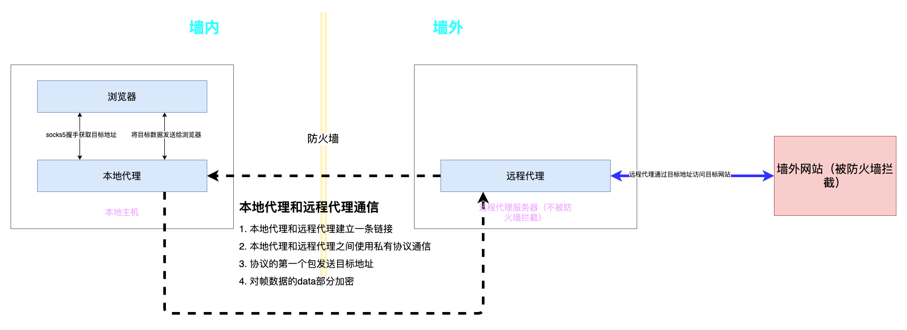
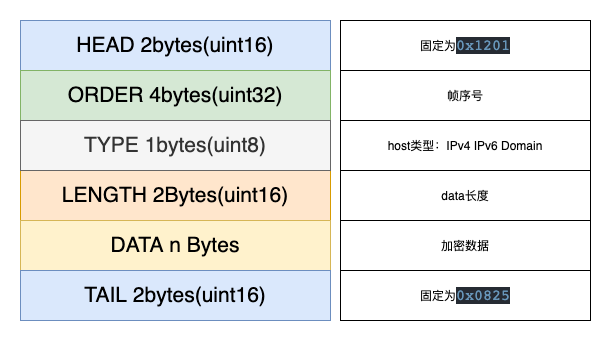

# YAO 代理通信协议

## 1. 协议介绍

为绕过防火墙实现数据安全转发而设计的应用层通信协议

工作原理图（该协议应用于本地代理和远程代理之间的通信，并约定本地代理和远程代理的工作职能）：

## 2. 名词解释

- 翻墙

  指绕过防火墙实现访问墙外网站

- 本地主机

  指运行在墙内的操作系统可以是Windows，linux，mac或其他操作系统

- 远程代理服务器

  指运行在墙外的服务器，该服务器可以被墙内操作系统正常访问，也可以访问墙外的不能被墙内直接访问的网站

- 浏览器

  指运行在`本地主机`上需要`翻墙`的应用（浏览器是这类应用的代表）

- 本地代理

  指运行在`本地主机`上的代理，用于`浏览器`和`远程代理`之间的数据转发

- 远程代理

  指运行在`远程代理服务器`上的代理，用于`目标站点`和`本地代理`之间的数据转发

- 墙外网站

  指那些不能在墙内被正常访问的网站

## 3. 协议约定

1. `浏览器`和`本地代理`之间的通信不由该协议强制规定，可以是socks5协议或其他协议，这些协议的解析握手由`本地代理`完成，本地代理需要通过这一步来获取目标地址的ip和端口，并发送给`远程代理`（第一个数据包）

2. `本地代理`和`远程代理`之间的通信使用本协议规定的格式，并要求数据部分需要aes加密
3. `远程代理`收到`本地代理`发送的过来的请求后便和目标网站建立tcp链接，然后负责目标网站和本地代理之间的数据转发

## 4. 帧数据格式

协议规定，发送的第一个包是目标地址，TYPE字段表示这个地址的类型，可以是IPv4，IPv6，Domain其中之一；Data字段表示加密后的地址：加密之前为（host port），最后两字节是端口，前面n字节是host

